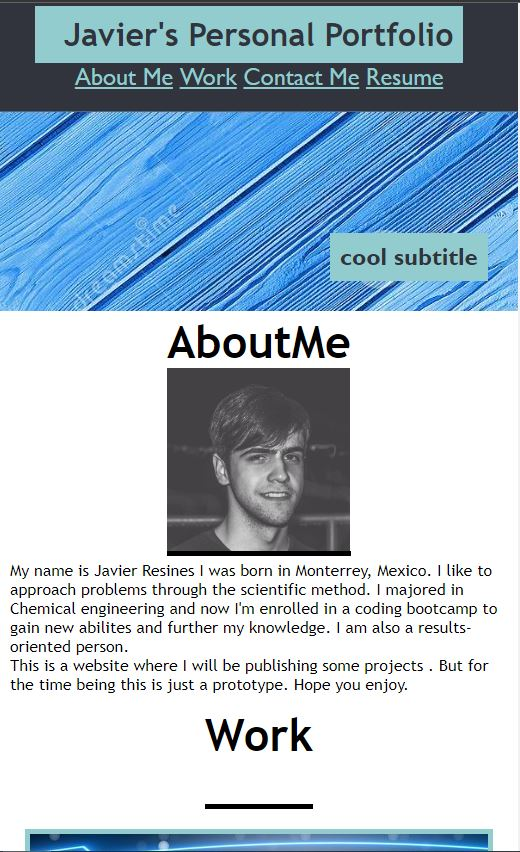

# Javier-R-Portfolio-website

DESCRIPTION:
This is a portfolio website, 
since I still don't have projects to show, I coded the css file
to show a website as close as possible to the mockup that was given for 
this homework. I focused more on the style and functionality of the page rather than the content.
 
Here's a link to the deployed website:
https://javierrmsf.github.io/Javier-R-Portfolio-website/

The website changes its arrangement once the width is reduced to 883px or less
here are two screenshots:

